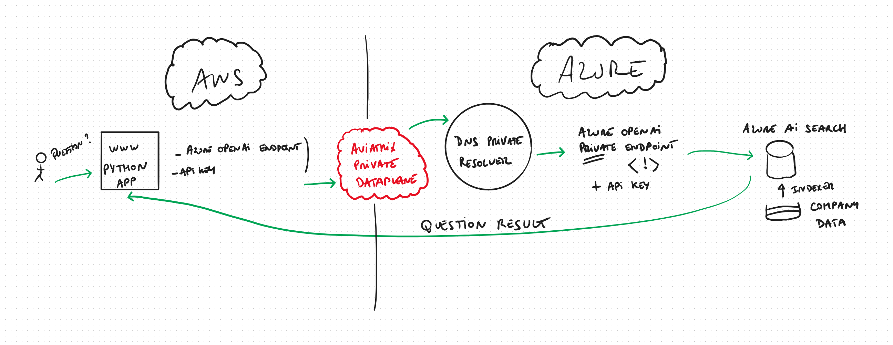

# Aviatrix OpenAI Multi-Cloud Demo

This Terraform deployment creates a multi-cloud infrastructure demo showcasing OpenAI integration with Azure AI Search using Aviatrix networking.

## Architecture Overview


**Packet Walk Explanation:**

1. **User Request:** The user accesses the OpenAI chat application hosted on the EC2 instance in the AWS Spoke VPC.
2. **Application Processing:** The application processes the request and prepares to query Azure Open AI and in turn, Azure AI Search.
3. **DNS Resolution:** The EC2 instance uses the custom DNS resolver to resolve Azure service endpoints privately.
4. **Aviatrix Transit:** The request traverses the Aviatrix Spoke Gateway to the Transit Gateway, enabling secure cross-cloud routing.
5. **Azure AI Search Query:** The request exits AWS via the Aviatrix Azure Transit Gateway over IPSec tunnel and reaches Azure AI Search over private connectivity.
6. **Response Path:** Azure AI Search and Open AI returns results via the same secure path, back to the EC2 instance.
7. **User Response:** The application sends the processed response to the user.

This packet walk demonstrates secure, private, and automated cross-cloud connectivity between AWS and Azure using Aviatrix networking for private endpoint access and private DNS resolution.

The deployment provisions:

1. **AWS Transit Gateway** - Central hub for network connectivity
2. **AWS Spoke VPC** - Application VPC with OpenAI chat application
3. **EC2 Instance** - Ubuntu server hosting the Microsoft OpenAI sample application
4. **Custom DNS Configuration** - Points to private DNS resolver for cross-cloud connectivity
5. **Security Groups** - Network security for internal and public access

## Components

### Infrastructure

- **AWS VPC**: `10.52.0.0/24` CIDR with multiple subnets
- **Aviatrix Transit Gateway**: `10.58.0.0/23` CIDR for inter-cloud connectivity
- **Aviatrix Spoke Gateway**: Connects application VPC to transit network
- **EC2 Instance**: `t3.medium` Ubuntu 24.04 LTS server

### Application Stack

The EC2 instance is automatically configured with:

- **Microsoft OpenAI Sample App**: Cloned from [sample-app-aoai-chatGPT](https://github.com/microsoft/sample-app-aoai-chatGPT)
- **Python Environment**: Python 3 with venv and pip for application dependencies
- **Node.js**: NPM for frontend dependencies
- **Rust/Cargo**: For building embedding tools
- **SSL Certificate**: Self-signed certificate for HTTPS (`chat.aviatrix.local`)

### Azure AI Search Integration

Pre-configured JSON schemas for:

- **Search Index**: Vector search capabilities with 1536-dimension embeddings
- **Indexer**: Content extraction and metadata processing
- **Semantic Search**: Enhanced search with BM25 similarity and HNSW algorithm

### Subnets

- **Public Subnets**: Aviatrix gateway and HA gateway subnets
- **Private Subnets**: Application servers (`front-a`, `front-b`)
- **Route Tables**: Separate routing for public internet and internal traffic

## Security

### Security Groups

1. **RFC1918 Internal**: Allows all traffic from private IP ranges (10.0.0.0/8, 192.168.0.0/16, 172.16.0.0/12)
2. **Public Web/SSH**: 
   - HTTPS (443) and HTTP (80-83) from anywhere
   - SSH (22) restricted to your public IP

### DNS Security

- Custom DNS configuration bypasses public DNS
- Points to private Azure DNS resolver for secure name resolution
- Enables private cross-cloud connectivity for DNS requests and Open AI access.

## Required Variables

```hcl
variable "aws_r1_location" {
  description = "AWS region for deployment"
  type        = string
}

variable "aws_r1_location_short" {
  description = "Short name for AWS region"
  type        = string
}

variable "aws_account" {
  description = "Aviatrix AWS account name"
  type        = string
}
```

## Deployment

1. **Clone Repository**:
   ```bash
   git clone <repository-url>
   cd aviatrix-openai-mutlicloud-demo
   ```

2. **Configure Variables**:
   ```bash
   cp terraform.tfvars.example terraform.tfvars
   # Edit terraform.tfvars with your values
   ```

3. **Initialize Terraform**:
   ```bash
   terraform init
   ```

4. **Plan Deployment**:
   ```bash
   terraform plan
   ```

5. **Apply Configuration**:
   ```bash
   terraform apply
   ```

## Post-Deployment

### Access the Application

1. **Connect to EC2 Instance**:
   ```bash
   ssh -i your-key.pem ubuntu@<instance-private-ip>
   ```

2. **Navigate to Application**:
   ```bash
   cd ~/sample-app-aoai-chatGPT
   ```

3. **Configure OpenAI Settings**:
   - Edit configuration files with your Azure OpenAI endpoint
   - Set up API keys and search service credentials

4. **Start Application**:
   ```bash
   # Follow Microsoft's setup instructions in the cloned repository
   python -m venv venv
   source venv/bin/activate
   pip install -r requirements.txt
   ```

### DNS Configuration

The instance is configured to use private DNS resolver at `10.147.70.116` for:
- Azure service name resolution
- Cross-cloud connectivity
- Private endpoint access

## Monitoring and Troubleshooting

### Logs

- **Cloud-init logs**: `/var/log/cloud-init-output.log`
- **Application logs**: Check the sample app documentation

### Network Connectivity

- Verify Aviatrix gateway status in controller
- Check security group rules
- Test DNS resolution: `nslookup <azure-service>.azure.com`

## Cleanup

```bash
terraform destroy
```

## Architecture Benefits

1. **Secure Cross-Cloud**: Private connectivity between AWS and Azure
2. **Scalable**: Aviatrix transit architecture supports multiple spokes
3. **Automated**: Complete infrastructure and application deployment
4. **Production-Ready**: Security groups, SSL certificates, and proper DNS
5. **Cost-Effective**: Single gateway deployment with HA options available

## Related Documentation

- [Aviatrix Documentation](https://docs.aviatrix.com/)
- [Microsoft OpenAI Sample App](https://github.com/microsoft/sample-app-aoai-chatGPT)
- [Azure AI Search Documentation](https://docs.microsoft.com/en-us/azure/search/)

## Support

For issues related to:
- **Infrastructure**: Check Terraform and Aviatrix documentation
- **Application**: Refer to Microsoft's sample app repository
- **Networking**: Verify Aviatrix controller and gateway status

